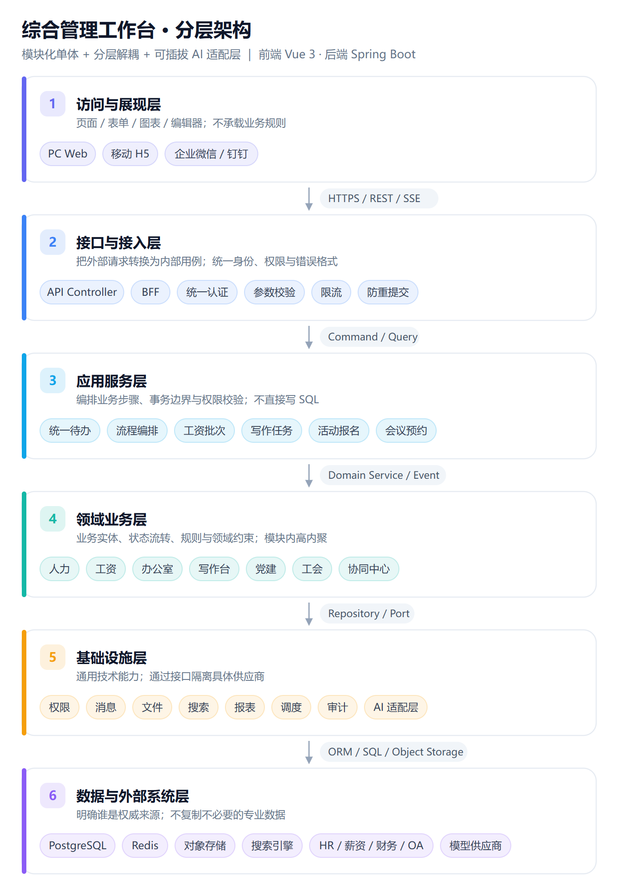
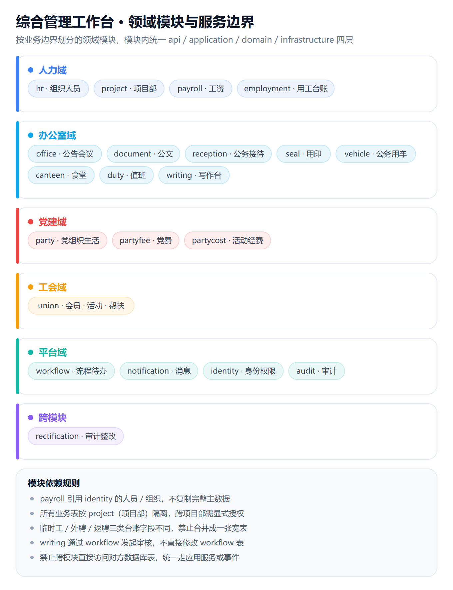
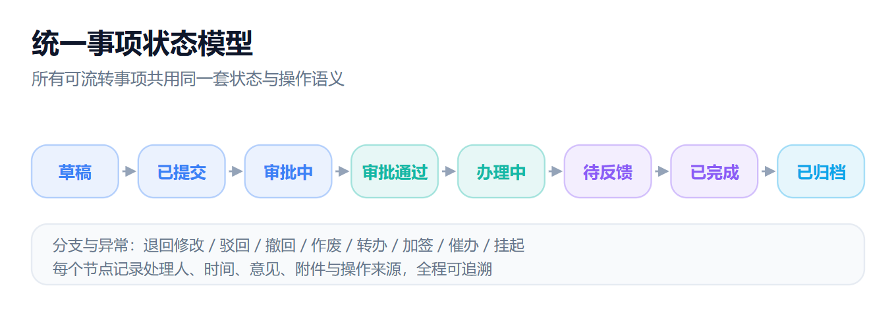
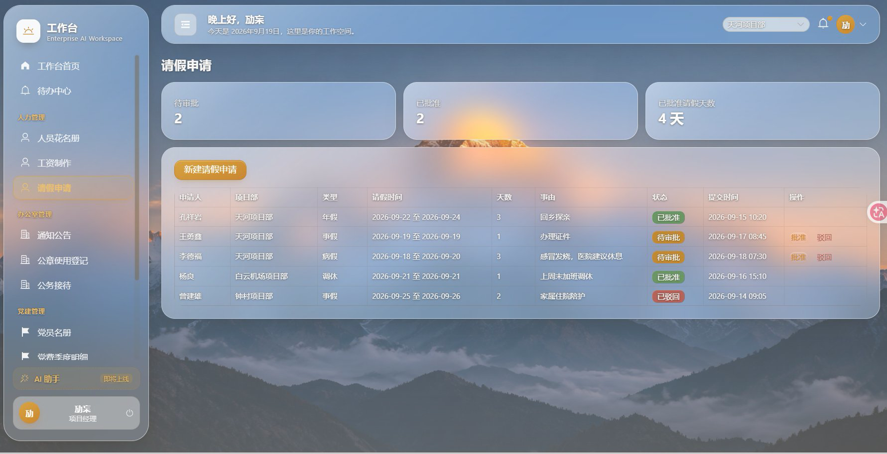

# 综合管理工作台 · Comprehensive Workbench

> 面向组织内部的统一管理工作台：把**人力、办公室、党建、工会**四大场景收敛到一个入口，统一承载待办、流程、消息、权限与数据。
> Unified internal ops workbench — HR / Office / Party / Union — with one entry point for todos, workflows, messaging, auth and data.

[](LICENSE)
[](web/)
[](server/)

---

## 1. 产品定位 / Positioning

**综合管理工作台 = 统一入口 + 统一待办 + 统一流程 + 统一数据 + 统一服务。**

它不替代已有的专业系统（HR / 财务 / OA / 档案），而是优先建设跨部门的工作入口、流程编排、事项协同与管理驾驶舱；涉及薪资核算、财务记账、档案原件等专业能力时，通过接口或链接与权威系统衔接。

核心设计原则：

- **业务统一**：四大模块共享组织、人员、角色、流程与消息基础能力。
- **一次采集、多处使用**：人员、部门、岗位、事项等基础数据尽量复用。
- **流程可追踪**：每个申请、审批、办理、归档事项都可查询当前状态与责任人。
- **权限最小化**：按组织、角色、岗位、数据敏感级别授权，默认不越权。
- **先实用、后智能**：先解决高频事项与数据断点，再逐步引入智能辅助。

---

## 2. 四大模块能力矩阵 / Capability Matrix

| 模块 | 核心能力 | 关键闭环 |
|---|---|---|
| **人力管理** | 组织/人员花名册、四类用工形式台账（正式/临时/外聘/返聘）、工资期间·批次·工资条·异议、请假/出差/加班/证明申请 | 工资条发布 → 员工查阅 → 异议反馈 → 管理员回复留痕 |
| **办公室管理** | 通知公告（发布回执）、写作台（模板/协同/版本/审核）、公文（上行文·下行文·会议纪要 + 文号自动生成）、会议预约与任务、用印、公务接待三联单（A/B/C 分类审批）、值班与食堂月报 | 会议预约 → 签到 → 纪要 → 任务拆解 → 责任人办理 → 验收归档 |
| **党建管理** | 党员/组织台账、组织生活（计划·签到·纪要·归档）、党费季度明细与封顶规则、学习记录、活动经费审批 | 组织生活「计划—通知—签到—材料—纪要—归档」闭环 |
| **工会管理** | 会员台账、活动报名/签到/反馈、福利与帮扶登记、慰问金审批发放、节日福利签收、意见提案闭环 | 提案提交 → 分类 → 转办 → 答复 → 满意度评价 |
| **平台能力** | 统一待办中心、统一消息中心、统一流程中心（可视化配置 + 按角色/金额/敏感等级路由）、统一文件与附件、全局搜索、数据中心（驾驶舱/报表） | 跨模块复用，事项统一进入待办并可催办/转办/加签 |

> 审计整改与自查是四大模块共有的闭环场景，统一沉淀为「问题—任务—证据—销号」台账。

---

## 3. 技术栈 / Tech Stack

### 前端 Frontend
| 领域 | 选型 |
|---|---|
| Web 框架 | Vue 3 + TypeScript |
| 构建工具 | Vite |
| UI 组件 | Element Plus |
| 状态管理 | Pinia |
| 图表 | ECharts |
| 表格/导出 | xlsx |
| 路由 | vue-router |

### 后端 Backend
| 领域 | 选型 |
|---|---|
| 语言/框架 | Java 17 + Spring Boot 3.3.5 |
| 数据访问 | Spring Data JPA |
| 接口 | REST 为主，SSE 用于消息/进度推送 |
| 权限 | Spring Security + 方法级 `@PreAuthorize` + RBAC/数据权限 |
| 校验 | Bean Validation |
| 构建 | Maven（`mvn -DskipTests package`） |

### 数据与基础设施 Data & Infra
| 领域 | 选型 |
|---|---|
| 关系数据库 | PostgreSQL 16 |
| 缓存 | Redis 7（带 `requirepass`） |
| 对象存储 | 兼容 S3 / MinIO（预留） |
| 部署 | Docker Compose 起步，后续可迁 Kubernetes |
| 监控 | 健康检查 + 日志 + 指标 |

### 大模型能力 AI（可插拔）
业务模块只依赖统一的文本生成 / 摘要 / 检索 / 校对接口，具体模型由 **Model Adapter** 实现（OpenAI-compatible / 国产模型 / 私有模型 / Mock）。优点：模型可替换、调用可审计、敏感材料可拦截、测试可模拟。写作台 AI 功能通过适配器接入，业务代码不绑定具体 SDK。

---

## 4. 架构 / Architecture

推荐路线：**前后端分离的模块化单体应用，后端按领域模块组织，内部采用接口层—应用层—领域层—基础设施层—数据层分层；外部系统通过集成层接入；大模型通过独立 AI Gateway/Adapter 接入。**

### 4.1 分层架构 / Layered Architecture



1. **访问与展现层** — 页面/表单/图表/编辑器；不承载业务规则（PC Web / 移动 H5 / 企业微信·钉钉入口）。
2. **接口与接入层** — 把外部请求转换为内部用例；统一身份、权限与错误格式（API Controller / BFF / 统一认证 / 参数校验 / 限流 / 防重提交）。
3. **应用服务层** — 编排业务步骤、事务边界与权限校验；不直接写 SQL（统一待办 / 流程编排 / 工资批次 / 写作任务 / 活动报名 / 会议预约）。
4. **领域业务层** — 业务实体、状态流转、规则与领域约束；模块内高内聚（人力 / 工资 / 办公室 / 写作台 / 党建 / 工会 / 协同中心）。
5. **基础设施层** — 通用技术能力；通过接口隔离具体供应商（权限 / 消息 / 文件 / 搜索 / 报表 / 调度 / 审计 / AI 适配层）。
6. **数据与外部系统层** — 明确谁是权威来源；不复制不必要的专业数据（PostgreSQL / Redis / 对象存储 / 搜索引擎 / HR·薪资·财务·OA / 模型供应商）。

> 编码约束：Controller 不包含核心业务规则与 SQL；应用服务调用领域对象完成状态变化、调用仓储接口读写、调用端口但不依赖具体厂商 SDK；所有模块通过应用服务或事件协作，**禁止跨模块直接访问对方数据库表**。

### 4.2 领域模块映射 / Module Map



后端按业务边界拆分为领域模块（如 `hr` / `office` / `party` / `union` / `workflow` / `identity` / `audit` …），每个模块内部保持 `api / application / domain / infrastructure` 结构。

模块依赖规则（节选）：

- `payroll` 可读取 `identity` 的人员/组织引用，但不复制完整人员主数据；
- 所有业务模块按 `project`（项目部）做数据隔离，跨项目部查询需显式授权；
- `writing` 可调用 `workflow` 发起审核，但不直接修改 workflow 表；
- `party` 与 `union` 复用人员主数据，分别维护党员/会员业务属性。

### 4.3 统一状态模型 / Unified State Model



所有可流转事项统一支持：

`草稿 → 已提交 → 审批中 → 退回修改 / 审批通过 → 办理中 → 待反馈 → 已完成 → 已归档`

必要时支持：`撤回、作废、驳回、转办、加签、催办、挂起`。

### 4.4 安全边界 / Security Boundaries

- 前端不能绕过后端直接访问数据库或模型供应商；
- 工资、党员、帮扶、敏感材料有独立数据权限策略与字段脱敏；
- AI 处理前有权限校验、敏感标记与审计记录；
- 关键导入、导出、发布、审批操作具备幂等与日志；
- 数据库与缓存仅绑回环地址（`127.0.0.1`），不暴露到局域网。

---

## 5. 界面截图 / Screenshot



> 工作台界面：侧边导航、待审批 / 已批准统计、申请列表与审批操作。

---

## 6. 快速开始 / Quick Start

### 环境要求
- JDK 17
- Node.js 18+
- Docker Desktop（用于本地 PostgreSQL + Redis）
- Maven 3.9+（或用仓库自带的 `./mvnw`）

### 方式 A：分步启动（推荐理解结构）

```bash
# 1) 后端：准备密码并启动数据库
cd server
cp config/application.example.yml config/application.yml   # 按需覆盖默认值
echo "WORKBENCH_DB_PASSWORD=请改成你自己的密码" > .env
echo "WORKBENCH_REDIS_PASSWORD=请改成你自己的密码" >> .env
docker compose up -d                       # 启动 PostgreSQL(5432) + Redis(6379)
mvn -DskipTests package                    # 构建 jar -> target/workbench-server-0.1.0.jar
java -jar target/workbench-server-0.1.0.jar   # 后端监听 :8080

# 2) 前端（另开终端）
cd web
npm install
npm run dev                                # 前端监听 :5173
```

打开浏览器访问 <http://localhost:5173>。

### 方式 B：Windows 一键启动

已内置 `start-workbench.bat`（幂等、可重复运行）：先启动 Docker 数据库，等待 PostgreSQL 就绪，再启动后端（`:8080`）与前端（`:5173`）。**要求已用方式 A 第 1 步构建好 jar，且 Docker Desktop 处于 running 状态。**

### 演示账号 / Demo Accounts

种子数据写入下列演示账号（密码统一为 **`Workbench@2026`**，仅演示环境）：

| 用户名 | 姓名 | 角色 | 项目部 |
|---|---|---|---|
| `chenguodong` | 陈国栋 | 项目经理 | 云岭项目部 |
| `limingyuan` | 李明远 | 项目经理 | 云岭项目部 |
| `fangjing` | 方静 | 人力管理员 + 财务 | 云岭项目部 |
| `wanghaitao` | 王海涛 | 普通员工 | 云岭项目部 |
| `zhaoqiming` | 赵启明 | 普通员工 | 云岭项目部 |
| `wujunjie` | 吴俊杰 | 普通员工 | 江湾项目部 |

> ⚠️ 部署到任何共享环境前，请务必修改默认口令，并参考 [docs/安全加固说明.md](docs/安全加固说明.md) 处理剩余风险项（首次登录强制改密、HTTPS、JWT 吊销等）。

---

## 7. 项目结构 / Project Structure

```
综合管理工作台/
├─ web/                      # 前端（Vue 3 + TS + Vite + Element Plus + ECharts）
│  ├─ src/
│  │  ├─ api/                # 接口封装
│  │  ├─ mock/               # 演示用合成数据（已脱敏）
│  │  ├─ stores/             # Pinia 状态
│  │  ├─ views/              # 页面（hr / office / party / union / 协同中心 / 系统管理）
│  │  └─ components/
│  └─ package.json
├─ server/                   # 后端（Spring Boot 3.3.5 + JPA + PostgreSQL + Redis）
│  ├─ src/main/java/com/workbench/
│  │  ├─ identity/           # 用户、组织、角色、数据范围
│  │  ├─ hr/ office/ party/ union/ workflow/ ...   # 领域模块（api/application/domain/infrastructure）
│  │  └─ ...
│  ├─ src/main/resources/application.yml
│  ├─ config/                # application.example.yml（gitignore 外的示例配置）
│  ├─ docker-compose.yml     # PostgreSQL + Redis（仅绑回环）
│  └─ pom.xml
├─ docs/
│  ├─ images/                # 架构图（SVG 源 + PNG）
│  ├─ screenshots/           # 界面截图
│  └─ 安全加固说明.md
├─ 综合管理工作台产品需求文档.md
├─ 综合管理工作台技术方案与架构分层说明.md
├─ 综合管理工作台业务调研与需求修订说明.md
├─ start-workbench.bat
├─ AGENTS.md
└─ .gitignore
```

> 内部资料（公司制度原文、真实业务数据、`.tools/` 构建链）按安全规范**不纳入本仓库**，由 `.gitignore` 排除。

---

## 8. 文档索引 / Docs

| 文档 | 内容 |
|---|---|
| [综合管理工作台产品需求文档.md](综合管理工作台产品需求文档.md) | 产品定位、用户角色、权限模型、四大模块功能需求、验收标准、MVP 范围 |
| [综合管理工作台技术方案与架构分层说明.md](综合管理工作台技术方案与架构分层说明.md) | 分层架构、技术栈、编码约束、模块依赖、AI 演进路线、ADR 决策记录 |
| [综合管理工作台业务调研与需求修订说明.md](综合管理工作台业务调研与需求修订说明.md) | 业务调研结论与需求修订说明 |
| [docs/安全加固说明.md](docs/安全加固说明.md)（公开脱敏版） | 安全加固清单（P0 已完成 / P1 待处理）与部署须知 |

---

## 9. 免责声明 / Disclaimer

- **本仓库为演示/作品集用途（portfolio demo）**，所有人员姓名、身份证号、手机号、工资数额、党费、慰问金等均为**合成假数据**，不含任何真实个人信息（《个人信息保护法》合规）。
- 公司名称（示范建工集团）、项目部名称（云岭/江湾/榕荫/南岸/荔园）均为**虚构示例**，与任何真实组织无关。
- 内部资料（公司制度原文、真实业务数据、内部构建工具链）已按安全规范排除在仓库之外。
- 写作台 AI 能力为「可插拔辅助」设计，**不直接自动生成未经审核的正式文件**；演示环境中 AI 调用需自行配置模型适配器。
- 生产部署请务必修改默认口令、启用 HTTPS、补齐 JWT 吊销与敏感字段管控（详见安全加固说明）。

---

## 10. License

[MIT](LICENSE) —— 可自由用于学习、演示与二次开发。
